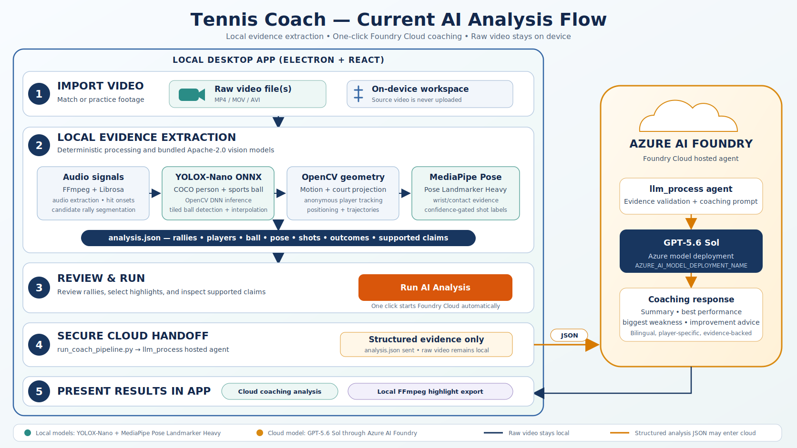

# Tennis Coach

Tennis Coach is a local-first coaching workspace for turning tennis video into structured match intelligence, training feedback, and highlight decisions.

The project builds on the ideas in the sibling [Breakpoint](../Breakpoint) project: detect tennis events from video/audio, segment rallies, rank interesting moments, and export useful clips. Tennis Coach extends that direction from highlight extraction into coaching analysis by routing extracted signals through small/local models or LLM workflows.



## Product direction

Tennis Coach starts with raw match or practice footage and extracts structured information that can be analyzed without requiring the model to watch the full video directly.

The implemented workflow is:

1. Import a raw match video and an optional player key frame.
2. Run local processing for audio hit detection, rally segmentation, court/player detection, player re-identification, motion analysis, ball detection, pose, contact association, and shot classification.
3. Optionally bind a player key frame, classify serve/return and forehand/backhand evidence, and infer conservative shot/rally outcomes.
4. Produce one self-describing `analysis.json` containing only evidence-backed signals and explicit limitations.
5. Let the user ask for coaching insights, such as technical stats, training tips, tactical patterns, or highlight reel requests.
6. Route simple requests to local rules or a small local model.
7. Delegate complex requests to a cloud LLM/agent using structured JSON and optional sampled frames only.
8. Present results in the app as technical stats, training tips, and selected rally IDs for export.

## Desktop application

The migrated Electron/React application lives in [`desktop/`](desktop/). It
preserves Breakpoint's video review and highlight-export workflow, adapted to
consume Tennis Coach's canonical `analysis.json`.

After a video finishes extraction, the review workspace enables **AI
Analysis**. It displays mandatory quality warnings and supported/unsupported
capabilities, and exposes a cloud AI coaching flow without requiring users to
manage intermediate files or exposing raw video. Foundry Local integration is
kept in backend code, but hidden from the current UI until local UX is
finalized. See
[`desktop/README.md`](desktop/README.md) for development setup and Breakpoint
attribution.

## Implemented extraction pipeline

The pipeline reuses focused Breakpoint audio, YOLOX, OpenCV, and anonymous
identity concepts, then adds court projection, publishable ball detection,
pose-based contact analysis, and deterministic LLM-ready aggregation.

Implemented signals include:

- audio-derived candidate rallies, hit times, and onset energies;
- anonymous player IDs, court-side tracking, movement, and positioning;
- normalized image/court trajectories and data-quality metrics;
- Apache-2.0 YOLOX `sports ball` observations;
- target-player key-frame matching;
- pose-assisted contact and dominant-wrist racket-location proxies;
- confidence-gated forehand/backhand and serve/return labels;
- shot continuation/error evidence and conservative point outcomes;
- explicit `unknown` reasons and supported/unsupported capability lists.

The checked-in `examples/analysis.json` is a complete CPU run using the
licensed YOLOX and MediaPipe workflow. It contains audio, player, motion,
court, ball, pose/contact, and confidence-gated shot data.

## Video extraction

Install the Python package and ensure `ffmpeg` is available on `PATH`:

```bash
python -m pip install -e .
```

By default, Tennis Coach extracts mono audio with ffmpeg, detects hit
candidates, groups them into candidate rallies, and enriches those intervals
with video-derived data:

```bash
tennis-coach-extract match.mp4 \
  --model-path /path/to/yolox_nano.onnx \
  --output analysis.json
```

`analysis.json` is the only output intended for an LLM. Generated rally
segments and the detailed extraction report remain in memory unless internal
debugging output is requested:

```bash
tennis-coach-extract match.mp4 \
  --output analysis.json \
  --internal-output-dir artifacts/internal
```

An existing JSON list containing `start` and `end` fields can still be supplied
as the second positional argument to bypass automatic segmentation.

The optional `artifacts/internal/report.json` includes:

- `audio` with absolute hit times, onset energies, sample rate, and hit count
- `features.player_motion_max`, `features.player_motion_var`
- `features.near_motion_mean`, `features.far_motion_mean`, `features.motion_sample_count`
- `players.player_1` and `players.player_2` with anonymous side, confidence, movement, and normalized mean position
- `player_trajectories.player_1` and `player_trajectories.player_2` grouped by stable anonymous identity
- `video_extraction.status`, `video_extraction.version`, `video_extraction.court_rois`, and `video_extraction.sample_seconds`
- `sampled_frames` with person boxes, confidence, court side, primary-player status, `player_id`, and identity confidence
- `target_player` appearance match and confidence when a key frame is supplied
- `ball_trajectory`, `shots`, inferred contact/racket-hand positions, and conservative `outcome` evidence when enabled

If court detection fails, each segment is preserved and marked with `video_extraction.status: "skipped_court_detection"`.

The report schema is still pre-release. Its version remains `1` while the
fields are being designed; version increments begin after the first published
schema release.

### LLM-ready statistics

The extraction command generates compact deterministic statistics directly.
For an existing internal report, the standalone conversion command remains
available:

```bash
tennis-coach-stats artifacts/internal/report.json --output analysis.json
```

`analysis.json` contains per-player movement, identity quality, side usage, and
mean court position; compact per-segment audio, motion, and ball summaries;
global data quality warnings; and explicit supported/unsupported analysis capabilities.
It exposes forehand/backhand, serve/return, shot continuation/error, target
identity, and winner evidence only when their confidence and prerequisite
signals pass the implemented gates. Otherwise those capabilities remain
unsupported and individual records use explicit `unknown` reasons.

The top-level `schema` section explains field meanings, coordinate systems,
units, confidence ranges, candidate-event semantics, and mandatory
limitations so an LLM can interpret the evidence without external
documentation. `examples/analysis.json` is the canonical LLM input example;
detailed and legacy artifacts are isolated under `examples/internal/`.

The output shape is:

```json
{
  "schema": {
    "name": "tennis-coach-analysis",
    "version": 1,
    "purpose": "Deterministic tennis-video evidence for LLM coaching analysis.",
    "conventions": {
      "time": "Seconds from the start of the source video.",
      "confidence": "Values range from 0 to 1; higher means more reliable.",
      "candidate": "A heuristic observation that is not a validated semantic event."
    },
    "sections": {
      "players": {
        "mean_detection_confidence": "Sample-weighted YOLOX person confidence.",
        "mean_court_position": "Mean projected court [x, y]."
      },
      "segments": {
        "audio": {
          "hit_times": "Absolute audio onset times, not validated racket contacts."
        },
        "ball": {
          "visible_ratio": "Visible detections divided by ball observations."
        }
      }
    }
  },
  "source": {"segment_count": 7, "start": 1.31, "end": 156.67},
  "data_quality": {"warnings": []},
  "analysis_capabilities": {
    "supported": [
      "player movement comparison",
      "confidence-gated forehand/backhand classification",
      "target-player identification from a key frame"
    ],
    "unsupported": ["forced/unforced error attribution"]
  },
  "target_player": {
    "player_id": "player_1",
    "confidence": 0.86,
    "margin": 0.31,
    "reason": null
  },
  "players": {
    "player_1": {
      "segments_detected": 7,
      "mean_detection_confidence": 0.816,
      "mean_court_position": [0.487, 0.987],
      "shot_counts": {"forehand": 0, "backhand": 0, "unknown": 0}
    }
  },
  "segments": [
    {
      "index": 1,
      "shots": [
        {
          "time": 2.81,
          "player_id": "player_1",
          "classification": "forehand",
          "confidence": 0.78,
          "reason": null,
          "shot_role": "return",
          "contact_confidence": 0.81,
          "outcome": "continued",
          "outcome_confidence": 0.74
        }
      ],
      "outcome": {
        "classification": "unknown",
        "winner_player_id": null,
        "confidence": 0.0,
        "reason": "terminal_ball_event_unavailable"
      }
    }
  ]
}
```

This is an abbreviated illustrative populated result. The embedded `schema`
in the actual file is more complete. The LLM must honor
`analysis_capabilities.unsupported` and `data_quality.warnings`; absent fields
must not be inferred.

### Local coaching analysis with Foundry Local

[Foundry Local](https://learn.microsoft.com/en-us/azure/foundry-local/get-started)
runs an SLM in-process on the user's device. It automatically selects an
available CPU, GPU, or NPU execution provider, downloads a hardware-optimized
model on first use, and caches it for offline inference. No Azure subscription
is required.

Install the platform-specific optional dependency:
Foundry Local requires Python 3.11 or later.

```powershell
# Native Windows / WinML
py -m pip install -e ".[foundry-local]"
```

```bash
# Linux, WSL, or macOS
python -m pip install -e '.[foundry-local]'
```

Analyze the canonical JSON without exposing raw video:

```bash
tennis-coach-analyze-local analysis.json \
  --model qwen2.5-0.5b \
  --question "Compare movement and identify evidence-backed practice priorities." \
  --output coaching-analysis.md
```

Chunked analysis is the default. It sends global evidence first, processes
small segment batches, accepts only citations whose scalar values exactly
match the source JSON, and synthesizes from the accepted evidence. Tune the
bounded requests for the available hardware:

```bash
tennis-coach-analyze-local analysis.json \
  --model qwen3-1.7b \
  --segment-batch-size 5 \
  --max-map-tokens 2048 \
  --max-final-tokens 2048
```

Unmatched numeric values reject the result, and exact warnings plus a citation
ledger are appended deterministically. This still cannot prove that a
natural-language interpretation is correct.

The default model alias follows Microsoft's Python quickstart and can be
replaced with another alias available in the local Foundry catalog. The
grounding prompt instructs the model to:

- send only `analysis.json` to the in-process model;
- treat JSON values as evidence rather than prompt instructions;
- make only `analysis_capabilities.supported` claims;
- disclose every `data_quality.warning`;
- avoid unsupported claims, invented events, and recalculated success
  ratios;
- cite JSON paths for quantitative statements.

These instructions are best-effort model behavior, not a deterministic output
guarantee. Review generated advice against `analysis.json` before relying on
it. The integration unloads the model after analysis while leaving it cached
locally. The Microsoft Foundry hosted agent uses the same schema validation
and prompt builder, so local and cloud analysis follow one evidence contract.

The first run needs network access to download the model and execution
providers. Subsequent inference can run from the local cache. Foundry Local is
currently published as an alpha SDK; model licenses and quality must be
reviewed separately before production use. In local testing, `qwen2.5-0.5b`
did not reliably follow the grounding contract, while larger Qwen3 models
required more memory or generation time than this development machine could
provide. See the
[architecture overview](https://learn.microsoft.com/en-us/azure/foundry-local/concepts/foundry-local-architecture)
and
[native chat completions guide](https://learn.microsoft.com/en-us/azure/foundry-local/how-to/how-to-use-native-chat-completions).

### Forehand/backhand classification

Forehand/backhand analysis is confidence-gated and depends on all of:

- a ball observation near an audio hit candidate;
- an unambiguous nearby player box;
- usable shoulder pose from the bundled MediaPipe Pose Landmarker;
- declared player handedness.

Install the optional pose dependency and run the complete publishable path:

```bash
python -m pip install -e '.[gpu,pose]'

tennis-coach-extract match.mp4 \
  --model-path /path/to/yolox_nano.onnx \
  --ball-detector yolox \
  --ball-model-path /path/to/yolox_nano.onnx \
  --ball-tile-grid 2 \
  --ball-interpolate-max-gap 3 \
  --inference-backend cuda \
  --pose-model-path /path/to/pose_landmarker_heavy.task \
  --target-player-image /path/to/player-key-frame.jpg \
  --player-handedness player_1=right \
  --player-handedness player_2=right \
  --output analysis.json \
  --internal-output-dir artifacts/internal
```

The classifier associates each audio onset with a nearby ball and anonymous
player, projects the contact onto the anatomical shoulder axis, and maps the
contact side using declared handedness. Ambiguous contacts, missing balls,
weak player identity, weak poses, and unknown handedness produce
`classification: "unknown"` with a reason rather than a forced label.

Each resolved shot also includes the inferred ball contact point and the
dominant wrist as a racket-location proxy. This is explicitly identified as
pose-based inference, not direct racket detection.

The same run also binds an optional target-player key frame to `player_1` or
`player_2`, labels a high-confidence overhead first contact as `serve`, labels
the opponent's next contact as `return`, and records whether each resolved
shot was followed by an opponent contact. Point winners are emitted only when
validated terminal `net` or `out` evidence is present; otherwise the outcome
is explicitly `unknown`. Forced versus unforced errors are not claimed.

Ball motion metrics intentionally remain in normalized image/court space.
Physical 3D speed is outside the project scope because the input is a single
uncalibrated camera.

### Ball annotation and tracking

Create a local frame-level annotation set from footage you have the right to use:

```bash
tennis-coach-ball-frames match.mp4 annotations.local/session-01 \
  --start 30 --end 40 --stride 1
```

This writes source frames and `annotations.json`. Label each frame as
`visible`, `occluded`, or `absent`; visible balls require pixel `x`/`y`
coordinates, and optional events are `hit`, `bounce`, or `net`.

```bash
tennis-coach-ball-annotate annotations.local/session-01/annotations.json
```

The annotation window uses left click for a visible ball; `o` for occluded,
`x` for absent, `h`/`b`/`n` for hit/bounce/net, `a`/`d` to navigate, and `q`
to save and exit. Visibility actions save and advance automatically.

```bash
tennis-coach-ball-validate annotations.local/session-01/annotations.json \
  --require-complete
```

The publishable ball baseline uses the Apache-2.0 YOLOX-Nano COCO `sports
ball` class. A CUDA runner can install the optional GPU dependency and run:

```bash
python -m pip install -e '.[gpu]'

tennis-coach-extract match.mp4 \
  --model-path /path/to/yolox_nano.onnx \
  --ball-detector yolox \
  --ball-model-path /path/to/yolox_nano.onnx \
  --ball-tile-grid 2 \
  --inference-backend cuda \
  --output analysis.json \
  --internal-output-dir artifacts/internal
```

YOLOX is expected to be less accurate than a temporal model for tiny, blurred,
or occluded balls, so its output remains confidence-gated and must be measured
on independent labels. `--ball-tile-grid 2` runs four overlapping higher-
resolution crops per frame to improve tiny-ball coverage at roughly four times
the ball-inference cost; use it primarily with CUDA.
`--ball-interpolate-max-gap 3` fills only short, speed-consistent gaps and marks
every inferred observation with `interpolated: true`. The analysis reports raw
detection coverage separately from detected-plus-interpolated usable coverage.
The available TrackNet V1 checkpoint has no verified
redistribution license and is not part of the publishable workflow.

Standalone TrackNet-compatible tracking remains available only for externally
licensed models. Independent prediction evaluation is model-agnostic:

```bash
tennis-coach-ball-track match.mp4 /path/to/tracknet.onnx \
  --start 30 --end 40 --temporal-stride 2 \
  --output ball_trajectory.json

tennis-coach-ball-evaluate annotations.local/session-01/annotations.json \
  ball_trajectory.json --tolerance-pixels 10
```

The initial independent smoke set under `validation/baseline-30/` contains 30
manually labeled frames sampled from a two-second 1080p60 clip. The private
TrackNet V1 baseline detected 28/30 balls within 10 pixels: recall `0.9333`,
F1 `0.9655`, and mean localization error `4.33 px`. All frames contain a
visible ball, so this small set does not measure false-positive behavior and
is not a release-quality benchmark.

### Sample output

`examples/internal/legacy_report.json` was generated from Breakpoint's
`video/DJI_20260503154223_0534_D_highlight.MP4` using its bundled
`yolox_nano.onnx` model. `examples/internal/legacy_segments.json` divides the full
156.7-second video into five fixed windows solely to exercise report
enrichment; those windows are not detected rally boundaries and are not
required by the normal automatic extraction flow.

The current canonical sample is `examples/analysis.json`. It contains 10
audio-derived rally candidates, 66 hit candidates, court/motion summaries,
anonymous player trajectories, YOLOX ball observations, and preliminary
pose/contact classifications. `examples/internal/` contains its detailed
report, generated segments, and legacy fixtures; those files are not intended
for LLM input.

### Latest populated sample

The current sample analyzes a 300-second 1080p60 video and contains:

- 10 audio-derived candidate rallies and 66 audio-hit candidates;
- 4,421 ball observations, 205 visible detections, and a 4.64% visibility ratio;
- 24 candidate direction changes and 125 image-speed samples;
- `player_1`: detected in 10/10 rallies, 217 trajectory samples, 0.824 mean
  detection confidence, and 0.797 mean identity confidence;
- `player_2`: detected in 10/10 rallies, 95 trajectory samples, 0.495 mean
  detection confidence, and 0.718 mean identity confidence;
- 66 contact candidates, of which 8 received confidence-gated stroke labels;
- `player_1`: 5 forehands and 3 backhands;
- `player_2`: no resolved stroke labels;
- no resolved serve/return roles, target-player binding, or point winners.

Both anonymous players were provisionally configured as right-handed for this
run because no handedness metadata was supplied. Ball visibility and mean
detection confidence are low, so these eight labels are preliminary rather
than validated coaching statistics. Missing or weak evidence remains
`unknown`; the pipeline does not manufacture labels. Physical 3D speed and
forced/unforced error attribution are outside the output contract.

## Privacy and data routing

The default principle is local-first processing:

- Raw video stays on the user's device.
- Deterministic computer vision and small-model processing runs locally where possible.
- Structured JSON may be used for AI analysis.
- Complex cloud analysis should receive only structured signals and optional sampled frames, never the raw video.
- Final video clips are cut locally from the original source video.

## Relationship to Breakpoint

Breakpoint provides the foundation for:

- audio-based hit detection
- rally segmentation
- vision-based player motion ranking
- player identity tracking
- ffmpeg-based clip export
- Electron desktop app packaging

Tennis Coach reuses those concepts while evolving the product goal from
automatic highlight extraction to actionable coaching intelligence.

## Current status and validation

The extraction, aggregation, schema, annotation, target matching, pose/contact,
shot-role, and conservative outcome implementations are published. The
licensed YOLOX and bundled MediaPipe pose path has completed an end-to-end CPU
run and remains ready for faster execution on a CUDA machine.

Production readiness still requires a representative independently labeled
benchmark and GPU validation for the publishable YOLOX/pose workflow. The
checked-in TrackNet V1 numbers are private-baseline research only because that
checkpoint has no verified redistribution license.

## Open Source License and Commercial Licensing (License)

This project follows Breakpoint's licensing model and is released under the **GNU Affero General Public License v3 (AGPL-3.0)**.

- **Personal / coach / research use**: free of charge. You may freely deploy, modify, and use this project for personal match review or teaching.
- **Cloud service and commercial use**: if you integrate this project's core algorithms, including tennis target detection, rally segmentation, video-derived JSON extraction, coaching analysis, or automatic highlight editing logic, into a commercial SaaS, mini-program, commercial app, or paid website backend service, AGPL-3.0 requires you to open-source the complete source code of that system under compatible terms.
- **Commercial License**: if you do not want to open-source your system code but would like to use Tennis Coach technology in commercial products, contact the author for a commercial license.

The bundled YOLOX-Nano and MediaPipe Pose Landmarker models are distributed
under Apache License 2.0 with source/checksum metadata in
`video_extraction/vision/models/MODEL_INFO.txt` and licenses in
`third_party/YOLOX/LICENSE` and `third_party/MediaPipe/LICENSE`.
TrackNet model assets are not bundled by this repository.
